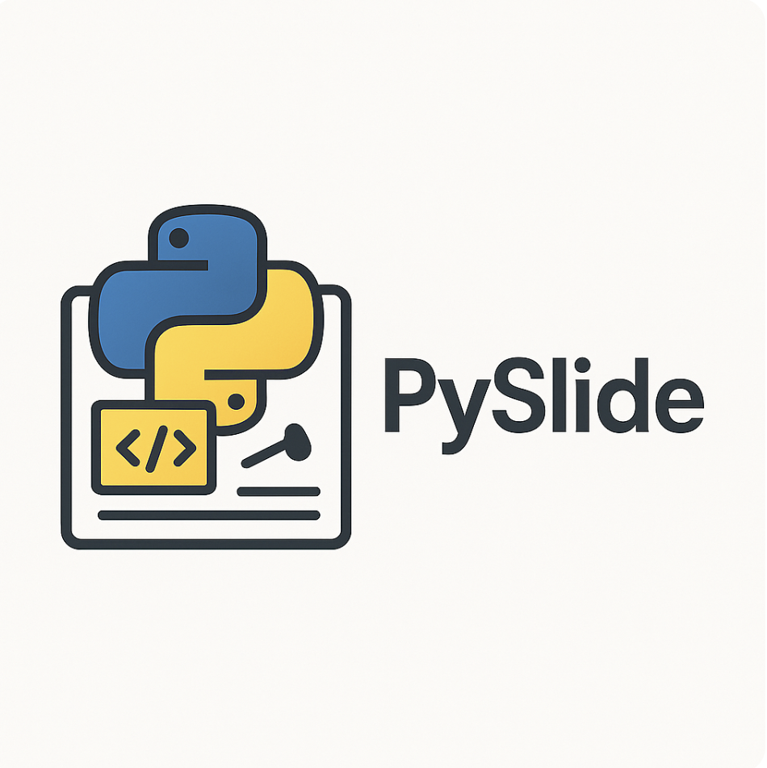
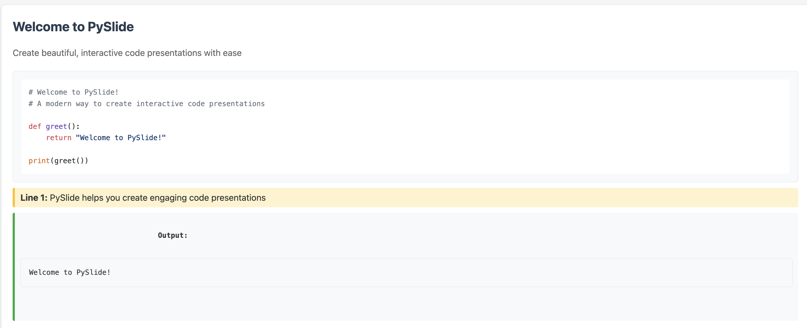

# PySlide: Interactive Python Code Presentations

PySlide is a modern, interactive presentation tool designed specifically for Python code demonstrations. It allows you to create engaging, executable code presentations with real-time visualization and annotation features.

## 🌟 Features

- **Live Code Execution**: Run Python code in real-time during presentations
- **Interactive Annotations**: Add explanatory notes to specific lines of code
- **Stack Trace Visualization**: Visualize function calls and execution flow
- **Image Support**: Enhance presentations with images and diagrams
- **Modern Interface**: Clean, intuitive web-based presentation interface
- **Customizable Styling**: Adapt the presentation look to your needs

## 📸 Screenshots

### Modern Interface

*PySlide's clean and intuitive presentation interface*

### Code Visualization

*Interactive code execution with annotations and stack trace visualization*

## 🚀 Quick Start

1. Install PySlide:
```bash
pip install pyslide
```

2. Create your first presentation:
```python
from pyslide import PySlide

# Create a new presentation
presentation = PySlide()

# Add a slide with code
presentation.new_slide(
    code="print('Hello, PySlide!')",
    title="Welcome",
    description="Your first PySlide presentation"
)

# Display the presentation
presentation.display()
```

## 📖 Documentation

Check out our [examples folder](examples/) for more detailed examples and use cases. The [welcome example](examples/welcome/introduction.py) is a great place to start!

## 🤝 Contributing

We welcome contributions! Feel free to:
- Report bugs
- Suggest new features
- Submit pull requests
- Improve documentation

## 📄 License

PySlide is released under the MIT License. See the LICENSE file for more details. 